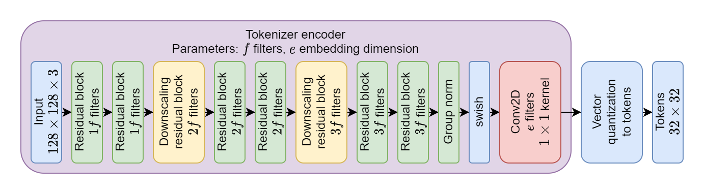
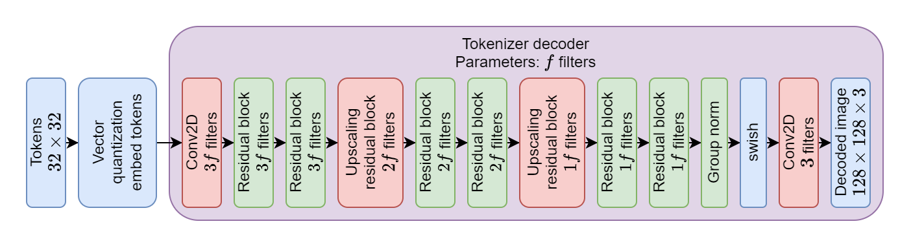
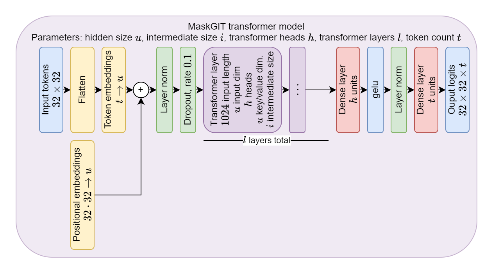
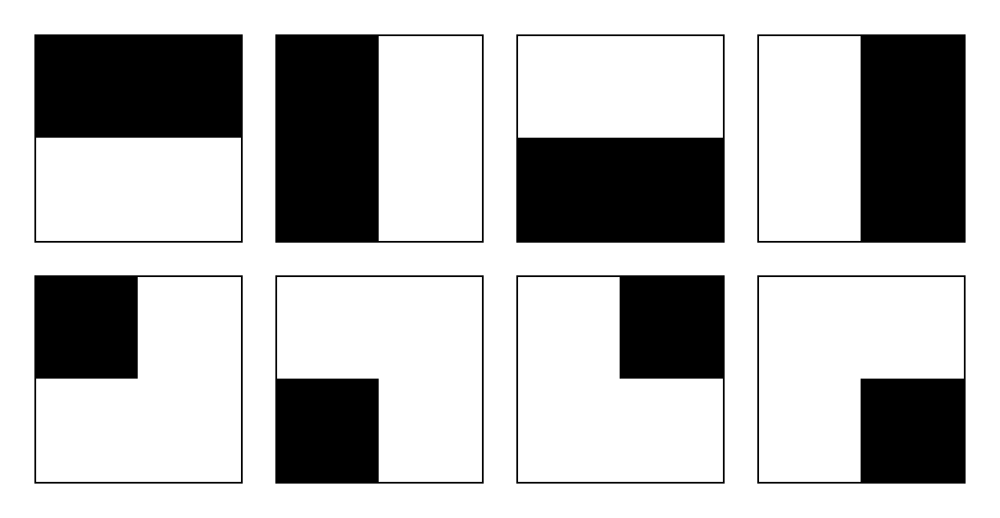
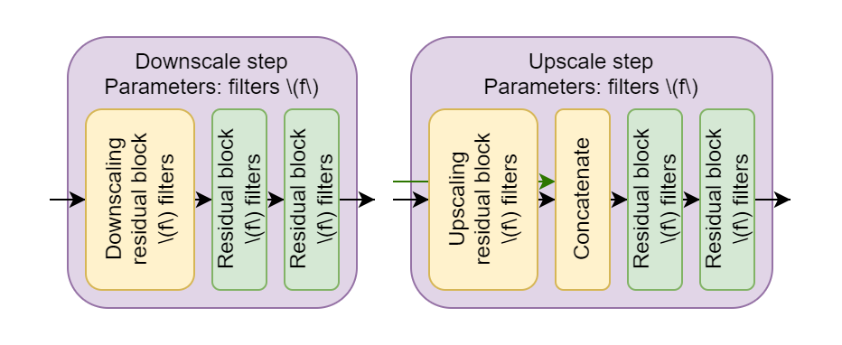
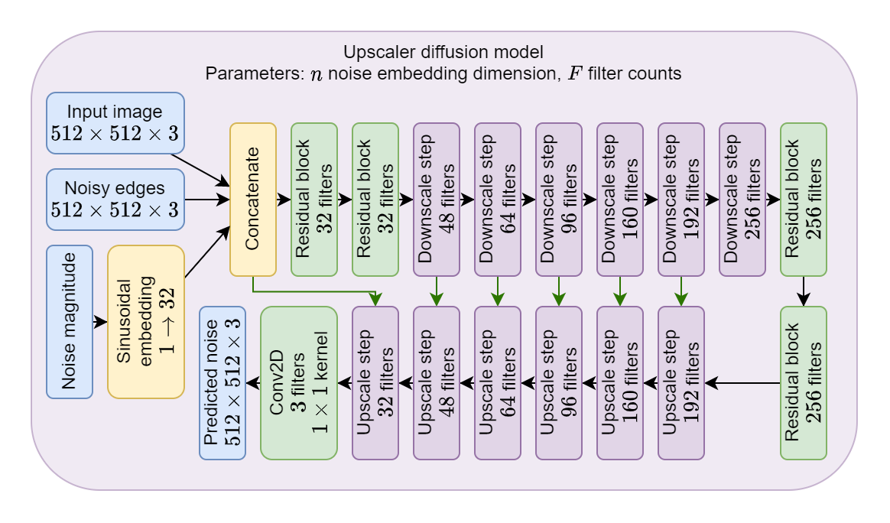
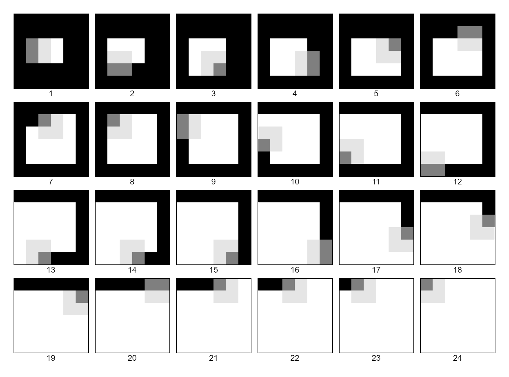
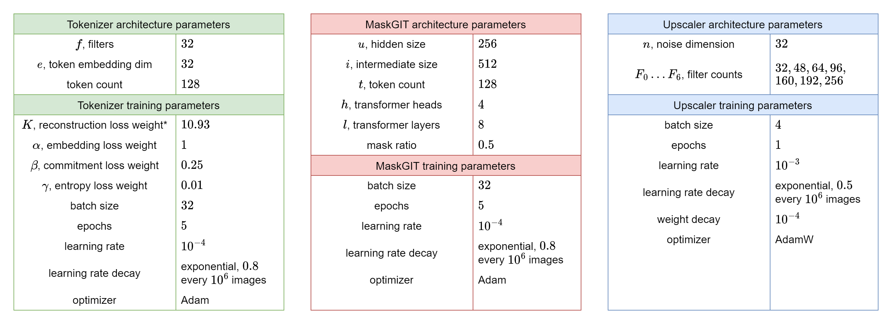
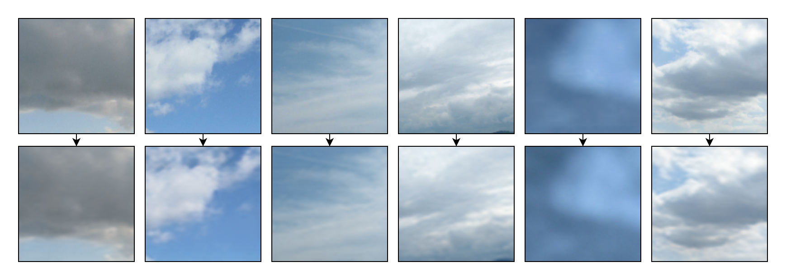
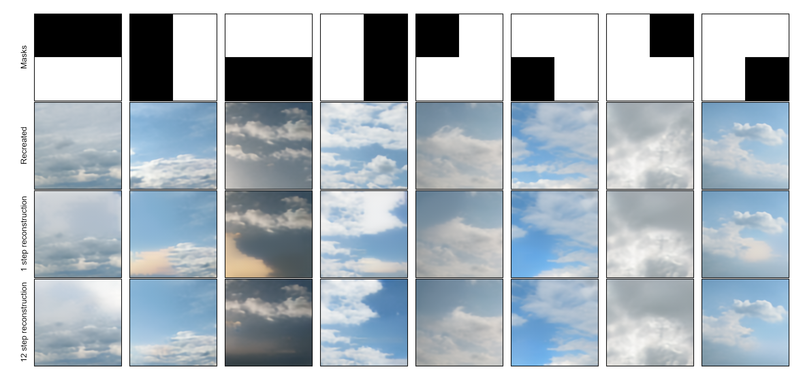

# Generative neural networks for sky image outpainting

## Abstract

We present an algorithm that can expand an image of the sky and expand it beyond its borders using neural networks. We use several state-of-the-art deep learning techniques to produce high-quality imagery trained only on cloud data.

## Introduction

This thesis aims to create an algorithm that can take an image of the sky and expand it beyond its borders - creating a larger, realistic image of the sky, with the original at its center. We leverage several modern tools in machine learning to accomplish this task, most prominently the MaskGIT [REF] architecture for generating a low-resolution output, and a diffusion model super sampler [REF] to scale the output to a higher resolution and add details.

### Motivation

We consider this thesis an interesting personal inquiry into the capabilities of generative neural networks. We also believe this work could further the capabilities of the SkyGAN network [REF], eventually finding applications in [FILL IN APPLICATIONS :D]

### Methods

We train the MaskGIT model and the underlying VQVAE tokenizer from scratch on a large dataset of segmented sky images. We first attempt to use the trained networks directly, using the VQVAE encoder to convert the image to tokens, then the MaskGIT for outpainting, and finally the decoder for conversion back to images. We perform multiple experiments, concluding that while our MaskGIT can generate images that look well overall, it fails when creating low-level details.

For this reason, we introduce another network based on diffusion models that can upscale images and add additional details, and train it on the same dataset. We then compare the results of MaskGIT with results passed through the new model and run multiple experiments by tweaking the parameters of the resulting algorithm.

## Background

In this chapter, we familiarize the reader with several topics from machine learning that are used in this thesis. This includes a brief introduction to neural networks and some more advanced architectures such as convolutional networks or transformers. Finally, we shortly introduce diffusion models, the model type we use for upscaling images.

### Neural networks

Neural networks are a type of machine learning model, composed of multiple layers (each of which is parametrized by some weights) and activation functions, each one represented by a mathematical operation. Each layer either operates on the output from a previous layer or on the model input, making the whole model a composite function, producing an output given input and the model weights.

The model trains by tweaking the weights of its layers to minimize a loss function, which measures how well the model performs on a given task. 

We first introduce the dense layer and ReLU activation function, on which we show the basics of how a model learns. After that, we show more advanced layers that will be later used for the models used in this work. 

### Introduction

The simplest neural network one can build is called a multi-layer perceptron. It consists of an input $I \in \mathbf{R}^{n}$, one dense hidden layer, and one dense output layer. A dense layer has a matrix of weights $W \in \mathbf{R}^{m \cdot n}$ and a vector of biases $b \in \mathbf{R}^n$, where $m$/$n$ are the input/output dimensions respectively, and a specified activation function $\sigma$. The layer output $y$ is then defined as $y = \sigma(x^T \cdot W + b)$, where $\sigma$ is applied to each element of the output vector individually. A simple dense neural network is shown in Figure 1.1:

*Figure 1.1: A simple MLP network, consisting of three layers - one input layer with 4 units, one dense hidden layer with 6 units and a *ReLU* activation, and a dense output layer with 4 units and a *softmax* activation. Each layer is parametrized by weights $W$ and biases $b$. Above each layer, we can see how its output is computed. Each arrow represents one connection - a single multiplication between a weight and a value.*

When illustrating complex neural networks, we do not want to visualize every single element of the output - we instead just represent individual operations, with arrows indicating which tensors are used as inputs. Consider the network from Figure 1.1 - a more compact representation is shown in Figure 1.2. All networks used in this work are presented in this way.

*Figure 1.2 - The same MLP as in Fig. 1.1, a more compact representation*

When we provide the input value $x_{input}$, we can compute the value of the first dense layer using its formula, then we repeat the same for the second dense layer, producing the network output.

### Training

To train the network, we need a training set containing examples that can be passed as input to the first layer and their respective outputs that define what the model should return for the given value. We also need to provide a loss function $L$, which serves as a measure of how far our model outputs are from the correct ones, defining what value should our model minimize. Commonly used loss functions include mean squared error for regression tasks and sparse categorical cross-entropy for classification.

Neural networks are trained using gradient descent - we want to compute the derivative of the loss function relative to each weight, and then change each weight slightly in the direction that reduces loss the most based on the current training example:

$$w' = w - \alpha \cdot \frac{\partial L}{\partial w}$$

The parameter $\alpha$ is called the learning rate, and it represents how fast our model should learn.

We begin by passing the example to the network input, evaluating the outputs, and computing the loss function. After that, we compute the derivatives of all weights using the *back-propagation* algorithm [REF].

In practice, there are two major distinctions - the gradient is averaged over multiple examples, called a batch, to produce a more accurate estimate, and the weights are updated using an optimizer - an algorithm that is provided with the gradient, which it can modify it in some way, and only then updates the weights. The optimizers we use in this work are all variations of Adam [REF], which also tracks the momentum of the gradient over multiple batches, and takes this information into account when updating network weights.

### Convolutional networks

#### Convolution basics

The aforementioned dense layers have several problems for image data - the image has to be flattened to a large one-dimensional vector first, completely losing any spatial data, and using another dense layer on top requires an enormous amount of weight parameters. To alleviate these issues, convolutional layers were introduced in [REF].

A convolutional layer can be viewed as an extension of the discrete convolution operation between two images. When using one input and one output layer, the output at a given position is computed by multiplying the surrounding pixels in the input by a convolutional matrix and applying an activation to the result, the values of which are the same for every position in the output and which represent the trainable weights. We visualize this operation in Figure 1.3. When using multiple input channels, each layer in the input has a separate convolution matrix, and the convolution results are summed before applying the activation. When using multiple outputs, each additional layer is computed in the same way as the first, just using a different matrix of weights.

*Figure 1.3 illustrates using a convolutional kernel at coordinates (1, 1). The same kernel would be used for all other positions as well. Multiple input dimensions would each correspond to a separate kernel, forming a kernel stack; Multiple output dimensions would use a different kernel stack each*

Convolutional layers are great at working with data locally, but unless an extensive amount of layers is used, they have no way to propagate information to the other side of the image. For this reason, downscaling layers were introduced - by using a greater distance (called stride) between individual matrix placements in the input, they can downscale the image, compressing the information to a smaller size. When upscaling is required instead, a transposed convolution, first introduced in [REF], can be used.

#### Residual connections & normalization

Convolutional networks require many layers, each of which performs a small part of the whole computation. For large networks, possible issues like *vanishing/exploding gradients* [REF] and increasingly more complex loss landscapes [REF] become more prominent. To address this, ResNet [REF] proposes residual connections, which boil down to taking an input, applying a series of layers, and then adding the result to the original input, forming a residual block. In the context of convolutional networks. A possible configuration is shown in Figure 1.4.

*Figure 1.4 shows a possible residual block. The bottom, processing part consists of a 2d convolution operation, a normalization (batch norm is used, but layer norm is common as well), a ReLU activation, and another convolution. After that, the result is added to the input. In cases when we want to change the number of filters or downscale the image, we add a convolutional block on the residual connection with linear activation.*

Another thing helping with training is new forms of regularization in the form of normalization layers, which all take some input data and try to shift and scale it so that it has a unit variance and a zero mean. The first to be proposed was a batch normalization layer [REF], tracking the mean and variance of each layer in a convolutional network, and shifting the values in each layer to conform to the properties mentioned above. More advanced forms of normalization appeared later, such as layer normalization [REF] and group normalization [REF], averaging values in each example individually and over groups of layers in an example respectively.

### Transformers

Originally introduced in the field of natural language processing [REF] as a successor to recurrent networks, transformers allow working with sequences of elements, where any element of a sequence can share information with all other elements at once. A typical transformer layer consists of two parts, a multi-head self-attention, which is responsible for interactions between multiple elements, and a dense layer processing part, which processes each sequence element individually.

The attention is implemented in the following way - for each element in the sequence, the input is a vector $x \in \mathcal{R}^n$, $n$ is dubbed *hidden_size*. The transformer parameters consist of three matrices, the key matrix $\mathbf{W^K} \in \mathcal{R}^{n \times d_k}$, value matrix $\mathbf{W^V} \in \mathcal{R}^{n \times d_v}$ and query matrix $\mathbf{W^Q} \in \mathcal{R}^{n \times d_k}$. These are used to compute the keys $\mathbf{K}=\mathbf{W^K}x$, values $\mathbf{V}=\mathbf{W^V}x$ and queries $\mathbf{Q}=\mathbf{W^Q}x$ - queries representing what we are looking for, keys representing what others should search for if they want to find the value in this place, and value, representing what will be found at this position. We can then compute the layer output as follows:

$$Attention(Q, K, V) = softmax \biggl( \frac{QK^T}{\sqrt{d_k}} \biggl) V$$

For reasons mentioned in previous sections, we also have a residual connection from $x$ to layer output and apply a layer normalization afterward. We also use multiple attention heads - this means doing the attention operation multiple times in parallel, with different query, key, and value matrices, concatenating the result, and using one last dense layer on every sequence element to project the result to the required size, before adding the residual value. The whole transformer layer is shown in Figure 1.4.

The processing layer is much simpler - it simply applies a dense layer with a different count of units, called *intermediate_size*, then an activation function, and finally another dense layer with *hidden_size* units. We then have another residual connection from the first hidden layer input, add both values together, and apply another layer normalization, obtaining the transformer layer output.

*Figure 1.5 shows a single transformer layer. The top block shows how the multi-head self-attention layer and the bottom shows the processing layer. Both of them combined constitute one transformer layer.*

### Embeddings

We often need to represent discrete data and work with them in our neural networks. The way used in this work is by using embedding layers. These can represent $m$ discrete values in $n$-dimensinal space, by storing an embedding matrix $E \in \mathbf{R}^{m \times n}$ values. When we need to convert a discrete value $t, \ \leq t \lt m$ to the target dimension, we select the row $E_{t*}$ from the embedding matrix and return it.

We can also use embeddings to encode information about positions in a sequence or an image - by associating each index with a vector in the embedding matrix, the network can learn useful representations for each position. We often add this positional embedding to the input data before a transformer layer, so that we can distinguish between different sequence elements inside the transformer layer.

### Diffusion models

Diffusion models [REF] are neural networks, trained to remove Gaussian noise from an image. Denoising is done as follows - we define a decoding schedule, $\beta(t), t \in [0, 1]$ which describes the magnitude of noise present in the image. During decoding with *decode_steps* iterations, at iteration $t$, we use the network to estimate noise in the target image - this allows us to roughly estimate the image without any noise. We then remove a small amount of the estimated noise from the image so that the magnitude matches the decoding schedule, and continue with this image in the next iteration. By removing all the noise from the image in small steps, we can generate new, high-quality samples. 

To train the network, we take a training image, select a random time from my decoding schedule, mix it with some pure Gaussian noise so the noise-to-signal ratio matches the schedule value, and minimize the difference between the noise prediction based on my image and the noise I introduced before.

## The Algorithm

This chapter describes all models used, how they are trained, and how they are utilized in the outpainting algorithm.

Our outpainting algorithm consists of three distinct models - a VQVAE tokenizer, the MaskGIT transformer model, and a diffusion model super sampler. The tokenizer consists of two parts, an encoder that can convert images to a latent space consisting of discrete tokens, and a decoder, which attempts to reconstruct the original image given tokens. The MaskGIT model takes in an image converted to tokens using the tokenizer, with some tokens getting masked out, and tries to reconstruct the original tokens. The super sampler gets an image on input, upscales it, and tries to fill in the missing details. For clarity, all models are visualized in Figure 2.1.

*Figure 2.1 shows all the models we use. On top, we have the tokenizer - it can convert images to discrete tokens, and tokens back to images. In the middle, we have MaskGIT - when provided with an image with some of its' tokens masked (marked as black in the image), it can replace the missing tokens with reasonable values. The bottom row shows the diffusion model. Provided with a low-resolution copy of the image, it can upscale it and add some details.*

During outpainting, we use the models as follows - first, we get the image we are trying to extend, pass it through the tokenizer encoder, receiving a set of tokens. After that, we repeatedly call the MaskGIT model, generating feasible tokens surrounding the original image, until a specified size is reached. When we are done, we use the tokenizer decoder to convert the tokens back to an image, which is then upscaled using the super sampler to create the final result. The process is described in more detail later in this chapter.

We will start by describing the dataset used to train the models. After that, we will show how every model is trained, and finally, we will show the details of how they work together during the outpainting process.

### Dataset

For training the models, we use the data graciously provided by the Czech hydro-meteorological Institute (further referred to as CHMI) [REF?] and collected by the computer graphics group [REF?] at Charles University. The data consists of 98 locations, each of which has a static webcam that saves an image of resolution 1600x1200 every 5 minutes. We use 94 of 98 locations available, excluding some with images of wrong dimensions or low-quality data. For each of them, images were being collected from March in the year 2021 to the time of writing, summing up to circa 200 thousand images per location, or approximately 19 million in total. We show some images from the dataset in Figure 2.2.

*Figure 2.2, unprocessed dataset examples. All contain the landscape and the sky, and an overlay with the CHMI logo and weather text.*

All images contain some part of the landscape, the CHMI logo in the left top corner, and some weather measurements in the top right, in addition to the sky. For this reason, we start by performing a simple segmentation on each location, figuring out which pixels are part of the sky and which ones are not, assuming that these do not change over the time of collecting the data. These masks are generated once before training, and their creation is described in more detail in the section below. When preparing the dataset for training a particular model, we downscale the images and masks and select a random part of the sky as model input, then filter the selected parts to condition the model to create more diverse images. In the following subsections, we first describe the segmentation algorithm in detail, then we describe how it is used to generate training data for each model.

#### Location segmentation

We base location segmentation on the following observation - during the day, the sky will change quite a lot, while the landscape stays mostly the same. The algorithm then boils down to detecting edges in an image, doing some processing, and then finding the places where edges are present many times during different times of the day. We describe the process of creating a segmentation mask, in which unmasked pixels are part of the sky, and masked ones are part of the landscape, the CHMI logo, or the weather information text.

I detect edges by computing the image gradient in the direction of the x and y axis and summing the absolute values of both directions and all RGB components. After that, we use a threshold, marking all values above it as parts of the landscape.

I then process the edge mask as follows - first, we perform the morphological closing operation [REF] with a 3x3 square mask five times in a row, making parts of the mask a lot more cohesive and filling in noisy areas. After that, we find all continuous non-landscape areas in the mask and mark all areas whose number of pixels is below a certain threshold (20000 pixels is used) as landscape. Then, we do the same for areas marked as landscape, discarding those with less than 300 pixels, considering them random noise.

After this, we hide the CHMI logo by masking a 270x115 rectangle in the top right and the weather measurements by masking a 250x250 rectangle in the top left. The process is shown in Figure 2.3.

*Figure 2.3, image segmentation on one image. Pixels colored red are parts of the mask. Gradient mask is obtained by masking all areas with a large enough gradient in the original image, closed mask by doing the closing operation, filled mask by filling small unmasked areas, discarded by discarding masked ones, masked sides by hiding the CHMI logo and the weather information.*

During daytime with bright skies, this generally produces an acceptable mask, with just a few mistakes, such as masked parts of clouds and missing masks over patches of the landscape of the same color. To fix these issues, we compute separate masks for a hundred consecutive time steps from one day (starting at noon so most time steps are during the day). Then, for each pixel, we compute the largest consecutive amount of time steps it has been marked as an edge and the percentage of the total time it was an edge. For an edge to be in the final mask, the consecutive amount must be above a certain threshold, and the percentage must be above another threshold.

We didn't manage to find thresholds that would work well for all locations and weather conditions, so we instead chose the thresholds manually for all locations. The final segmentation masks are presented in Figure 2.4.

*Figure 2.4, final segmentation. We show one sample image, the resulting mask, and the image with mask overlay for one location, Brno.*

#### Generating training data

We now describe how to generate a training example, assuming we have a loaded image and its' segmentation mask, both of size 1600x1200. When mentioning color constants in the following paragraphs, we assume all images to be normalized with values between 0 and 1.

We generate training data by downscaling both the image and the mask by some factor based on the model being trained, and selecting a random subset that contains only sky pixels according to the provided mask. We believe this is better than simply scaling the image or using any part of it as it enables us to eliminate unwanted stretching artifacts while not having to worry about dealing with landscape pixels during training. It also conditions the networks to learn exclusively about the sky, which is what we want to generate during outpainting. The tokenizer and MaskGIT networks take inputs of size 128x128, so we found it useful to downscale the images by a factor of 4 before selecting the area, allowing the training to select a large part of the sky while still fitting multiple positions above the landscape. As the super sampler takes images of size 512x512, we don't downscale at all.

We also found it useful to filter the images created by the procedure above to condition networks to generate more interesting images. First, we discard all images that were recorded during the night - because the downscaled training data doesn't have a high enough resolution to capture any stars or planets in the night sky, all the images are pitch black, and there is nothing of interest to generate. We consider all images with a mean less than 0.2 to be those of the night sky, and discard all of them, filtering out about 40% of all input images.

We also try to increase variability in the generated images by limiting the number of monochrome images present in the training data. We found that using the unrestricted dataset makes it highly likely that we will get a single-color image during outpainting as well. Because we want to drastically limit this behavior, but not eliminate generating monochrome images altogether, we choose to keep 10% of the monochrome images with a standard deviation from their mean of less than 0.05, and all others, filtering out another 50% of the dataset. 

Although we eliminate quite a large chunk of the training data during this step, we find it worth the increased quality in generated samples, and no measurable decrease in performance, partly due to the abundance of data available. The example data from each part of the process is shown in Figure 2.5.

*Figure 2.5, dataset filtering. The first row shows images from the unfiltered dataset, the second one from the dataset with night images filtered out, and the third row shows the final dataset, with both night and monochrome images discarded.*

### The models

In this section, we describe all the models that will be used in the outpainting algorithm, how they are trained, and their results.

#### Tokenizer

The tokenizer is responsible for taking in images and converting them to a latent space consisting of discrete tokens. The architecture is based on the vector quantization variational autoencoder [REF] and consists of three parts - an encoder, the vector quantization layer, and a decoder. The encoder takes images as input, processing them using multiple residual blocks and downscaling convolutions, and outputs a downscaled image of embedding vectors in an embedding space. The vector quantization layer then takes the vectors in embedding (or latent) space, and attempts to represent each of them using a discrete token, then it converts the tokens back to the embedding space. The decoder then uses more residual layers and transposed convolutions to attempt to reconstruct the original image from the vectors in the embedding space. Our variant of the VQVAE trains on images of size $128 \times 128$ and uses a latent space of dimensions $32 \times 32$. We describe the architecture and training process of all model parts in this section.

In the description of both the encoder and decoder, we use the variations on the residual block introduced in Figure 2.6.

*Figure 2.6, residual blocks used in the tokenizer. All convolutions have 3x3 kernels and linear activations. The dashed block in default convolution is active only when the input image has a different number of filters than $f$, and uses a $1 \times 1$ kernel.*

We use the encoder architecture as shown in Figure 2.7:

*Figure 2.7, tokenizer encoder architecture. Using 2 downscaling blocks results in a 4-times downscale, and using the vector quantization layer on the output results in an output of $32 \times 32$ tokens*

The vector quantization layer can be viewed as an extension to the embedding layer with added support for converting vectors to discrete tokens. The inverse operation is implemented by simply taking the closest vector in the embedding matrix according to the L2 metric and using the associated token, while the conversion back is the same as in the original embedding layer. During the forward pass, we apply both operations in order - first the conversion to tokens, then embedding them back. To be able to train the network using backpropagation, we need to be able to compute the gradient of the loss relative to the layer inputs when provided with the gradient of the outputs. Thankfully, albeit our layer is not differentiable, as both the layer inputs and outputs share the same embedding space, VQVAE proposes to copy the gradient from output to input, propagating useful information and enabling the model to be trained.

The decoder uses an architecture similar to the encoder, just using upscaling convolutions instead of downscaling ones, as presented in Figure 2.8.

*Figure 2.8, tokenizer decoder architecture. Again, two upscaling convolutions are used, upscaling the tokens four-fold while attempting to reconstruct the original colors.*

Using the terminology from VQVAE ($x$ is the model input, $z_e(x)$ is the encoder output, $z_q(x)$ is the vector quantization layer output), we train the model using the following loss:

$$L = K\log p(x|z_q(x)) + \alpha ||sg(z_e(x)) - e||_2^2 + \beta ||z_e(x) - sg(e)||_2^2 + \gamma c_t ||e_t - v_t||_2^2$$

The first three terms are from the VQVAE article, their rationale is as follows:
 * $K\log p(x|z_q(x))$ - The reconstruction loss multiplied by a constant, $K$. When we interpret the model outputs as means of a normal distribution for each pixel, this term can be derived to be equal to the mean squared error between decoder outputs and encoder inputs, multiplied by a constant, $K$, which we set to the inverse of the variance in the input data, $K=1/Var(x)$.
 * $\alpha ||sg(z_e(x)) - e||_2^2$ - The VQVAE embedding loss. Using the stop gradient $sg$ operator, it changes the codebook vectors in the vector quantization layer to be closer to encoder outputs.
 * $\beta ||z_e(x) - sg(e)||_2^2$ - VQVAE commitment loss. Attempts to move encoder predictions closer to embedding vectors to increase training stability.

We found that the original VQVAE tended to leave some vectors unused, missing out on potential generation quality. For this reason, we introduce the following loss: $\gamma \sum_{t \in T} c_t ||e_t - v_t||_2^2$. Going over all VQVAE tokens $T$, $c_t$ is $1$ if the token was used for embedding the last batch, $0$ otherwise. $e_t$ is the closest encoder result vector from the last batch, and $v_t$ is the token embedding in the codebook. The loss moves unused embedding vectors closer to encoder outputs in the last step, increasing their chance of being used the next time.

In the following sections, we use the following terminology: Using the tokenizer/encoder for conversion to tokens means applying the encoder and the first part of the VQ layer. Analogously, using the decoder to convert tokens to an image means embedding the tokens using VQ, and using the decoder to get an image.

#### MaskGIT

The masked generative transformer model [REF] is responsible for doing outpainting on tokens - given an image with half or a quarter of its' tokens masked out, it can replace the hidden tokens with ones that feasibly complete the image. We base our model structure on the original MaskGIT article and only slightly modify the training process. We first describe the model architecture, how we use it when generating masked tokens, and finally, how we train it.

The MaskGIT architecture is greatly inspired by BERT [REF] from the area of NLP, just generalized for images. It takes an array of tokens as an input, some of which may be replaced with a special symbol, *MASK_TOKEN*, to signify that the model should try to predict the token in this place, and outputs, for each place, a set of logits, each one corresponding to a token from the tokenizer codebook.

The exact architecture used is presented below in Figure 2.9.

*Figure 2.9, MaskGIT architecture. The token embedding layer contains trainable embeddings for each token, while the positional embeddings contain one for each sequence position.*

We now continue by describing the way new tokens are generated, the process used is the same as in the original article, but we provide a brief summary. In theory, the model would be able to generate all tokens in a single pass, but we can get samples of much better quality if we allow multiple generation steps. We use the cosine mask scheduling function $\gamma(x) = cos(2*pi*x)$ from the original article and set the *decode_steps* and *generation_temperature* parameters, specifying how many times we call the model when generating the image and how creative should the model be when guessing tokens respectively.  Starting with an input token array where some tokens are equal to *MASK_TOKEN*, we run the following algorithm:

$N =$ number of unknown tokens in input tokens

For $t = 1$ to *decode_steps*:
* Use the MaskGIT model to predict masked token logits. If we already know a token, we replace its logit with infinity.
* For each position, compute softmax over all logits to obtain token probabilities. Sample one token at random for every position - because we set the token logit to infinity, this will preserve the input tokens.
* Compute the number of tokens that should be masked after this step, $K=\gamma(\frac{t}{decode\_steps}) * N$
* We obtain confidence values by adding logits corresponding to the sampled tokens and random values from the Gumbel distribution with a scale equal to *generation_temperature*.
* We take the $K$ lowest confidence values and replace their values in sampled tokens with the MASK_TOKEN. Then, we set the input tokens for the next step to sampled tokens.

When the cycle finishes, we are left with the newly created tokens.

During outpainting, we generally know a part of the columns or rows in the input token image and need to generate the tokens adjacent to them. As this is the only thing we will use the model for, we incorporate it into the training process, modifying the original MaskGIT. We define a *mask_ratio* constant, defining the percentage of rows/columns that will be masked. During outpainting, we either know the unmasked rows/columns, or we know both, and the only missing part is one corner. Based on this, we define training masks, 8 in total, describing all possible usages of the model, shown in Figure 2.10.

*Figure 2.10 - all MaskGIT training masks. White and black pixels represent known and masked tokens respectively.*

We modify the training process to use our training masks as follows:

* We sample a ratio $t$ between 0 and 1
* Using the cosine scheduling function from the section above, we obtain a *mask ratio* $= \gamma(t)$
* We take an image and keep all tokens that are marked as unmasked in the training mask. We mask all other tokens with probability *mask_ratio*.
* We minimize the negative log-likelihood of the masked tokens.

#### Diffusion model super sampler

Because the tokenizer tends to lose some details when decoding from tokens, we use an upscaling model loosely based on [REF] to add details to the final image and upscale it. For this, we use a diffusion model with a cosine generation schedule, where the signal we try to predict is edges - values that should be added to the blurry image to generate a sharp version. We describe the architecture of the model here, and how it is trained.

The model inputs are the blurred 512x512 images, the ratio of the noise component relative to the signal as a sinusoidal embedding, and the edges, with a noise component added. We train the model to predict the noise component in generated edges. The architecture we use is based on U-Net [REF], and it uses the same residual blocks as the tokenizer for encoding/decoding. At each resolution, we use residual blocks to process the data, then a downscaling block into more filters, until images of size 8x8. We then do the inverse, using upscaling convolutions into fewer filters, concatenate with the processed images at the same level created during downscaling, use a residual block on the whole stack, and upscale again, until we reach the target resolution of 512x512. We then predict the final noise in the image using a linear layer. To illustrate the architecture, we first present some building blocks used in Figure 2.11, then the architecture itself in Figure 2.12.

*Figure 2.11, downscaling and upscaling blocks that will be used for presenting the super sampler architecture. The upscaling block uses two input parameters, denoted by arrows of different colors.*

*Figure 2.12, super sampler architecture. Input image, noisy edges, and noise variance are all used as model inputs, predicted noise is the only output. To make the illustration more compact, the model execution starts to the right, but continues to the left below, in the direction of the arrows. During processing, the model downscales the image 6 times, to a resolution of $8 \times 8$, then scales it back up. For clarity, we show the amounts of filters used in the final model, even though this is a modifiable parameter.*

For the training procedure, we need to find the target edges. by taking a high-resolution image, downscaling it to the tokenizer input size, passing it through the tokenizer, and upscaling it again, obtaining a blurry image. We get the edges by subtracting the blurry image from the original, high-resolution one. With this, we can train the model like a generic diffusion - we mix the target edges with a random amount of noise according to a random time in our diffusion schedule, and the model attempts to approximate the noise.

Upscaling tokenizer outputs can be done simply - we first upscale the image using bicubic interpolation and use the diffusion model iterative decoding to estimate the edges in it. After it is done, we add the edges to the blurry image, and clamp all values between 0 and 1, obtaining a sharp copy.

### Outpainting algorithm

We now describe how to perform outpainting using the trained models. We assume we start with an image of the same size as the tokenizer input and want to expand it beyond its borders. We allow specifying the *outpaint_range* and *samples* parameters - the outpaint range defines how many outpainting steps the model should take, and the samples define the quality of decoding. We use the tokenizer to convert the input image to tokens, then we use the MaskGIT to perform outpainting on the created tokens, and finally, we use the super sampler to generate high-quality samples. We visualize the whole process in Figure 3.1, each step is described in more detail below.

*Figure 3.1, a simple overview of the whole algorithm. MaskGIT/tokenizer/upscaler are called multiple times during the last three steps, to cover the whole outpainted image.*

After converting the input image we reserve space around it for the tokens we want to generate and set them all to *MASK_TOKEN*. After that, we move around the perimeter of known tokens in the order from Figure 3.2 and use MaskGIT to generate new tokens around it, until the whole space is filled.

*Figure 3.2, outpainting order. We start with known tokens in the middle (white) and unknown everywhere else (black). Gray tokens are the ones currently being outpainted, light gray are known tokens currently being fed into the MaskGIT to create new ones.*

When all tokens have been generated, we want to convert them back to an image. Because calling the tokenizer decoder directly on neighboring blocks of tokens can introduce artifacts (as we have no guarantee that the borders will be smooth), we instead use a sliding window, call the decoder with many overlapping squares of tokens, and average the results. The centers of the generating blocks are on a regular grid, and the *samples* parameter specifies how many more times we call the decoder, relative to neighboring blocks. This process produces multiple overlapping images - to compute the final image, we use a weighted averaging of the colors on a given position. Using weights equal to 1 everywhere can sometimes still produce visible edges in the final image in places where one block ends. To eliminate this, we use smaller weights for colors near the edge of their output image, while those at the center have large ones.

The previous step created an outpainted image, but due to averaging and data loss when using the tokenizer, the output is often blurry. We fix this with the last network, the super sampler, which can add details to the outpainted image and upscale it. We once again work on a grid, this time, we only introduce small overlaps to avoid inconsistencies between neighboring parts of the image. Then we gradually go over all grid positions and call the super sampler for each one. If we already know some part of the result, because it was computed before, we alter the diffusion model generation slightly - during each decoding step, when we separate the edges into noise and signal data, and estimate the image in the next step using the two, we replace the estimated signal values with the values we already know. After every position is done, we are left with the upscaled image.

### Results

We present the hyperparameters we used to train all three models, and the results achieved during training and when running the whole algorithm.

We show the parameters used to train all three models in Table 4.1, then present the results for each model separately.

*Table 4.1, model parameters*

#### Tokenizer results

The tokenizer gets an image as input, converts it to tokens and back, losing some information in the process, we are mainly interested in how much information was lost during the conversion. First, we present sample images and their reconstructions in Figure 4.2, then, the loss progression during training below in Figure 4.3.

*Showing tokenizer results. The top row consists of dataset images, the bottom one contains reconstructed ones. Information loss can be seen in local details, images are significantly more blurry.*

[!!!TOKENIZER LOSSES]

#### MaskGIT results

We train the model to predict the masked tokens. The results we illustrate represent an image being converted to tokens using a tokenizer encoder, hiding some tokens by applying any MaskGIT training mask, using the MaskGIT to reconstruct the missing tokens, then using the tokenizer decoder to convert the result back to an image. We show both the results when decoding during one step, and when using *decode_steps*, in Figure 4.3.

*Figure 4.3 - MaskGIT results. The first row shows images, just passed through the tokenizer. The second row shows which tokens (black) I discard before attempting to reconstruct them using MaskGIT. The third row shows how MaskGIT can reconstruct the missing parts in one step, and the last row shows how it can recreate them using 12 steps, with the generation temperature set to 1.0. The last row contains relatively few details, this is due to the fairly low generation temperature. We perform experiments with various values later on.*

During training, we track multiple metrics, most importantly validation accuracy on predicted tokens and validation loss, which can be seen below:

[!!!MASKGIT LOSSES]

#### Upscaler results

For the super sampler results, we present the original image, the low-resolution version, and how we manage to recreate the upscaled image, in Figure 4.4.

*Figure 4.4, super sampler results. The first row is the original image. For the other two rows, we downscale the image, pass it through the tokenizer, and attempt to upscale it. The second row shows the upscaling done via bicubic interpolation, and the last one shows how the super sampler performs.*

During training, the most important metric is the validation loss when predicting noise in an image - during training, it develops as follows:

[!!!UPSCALER LOSS]

#### Outpainting results

We perform experiments with the parameters shown in Figure 4.5:

[!!!OUTPAINTING PARAMETERS]

We show the original image, then two outpainted versions with the original image placed at the center - one without any upscaling, and one after applying the super sampler with sharpening.

[!!!OUTPAINTING RESULTS]

## Conclusion

We trained three separate models, the VQVAE tokenizer, the MaskGIT transformer, and the upscaling diffusion model, on a large dataset of sky images. We then developed an algorithm that combined the trained models to perform sky image outpainting and found the best hyperparameters for the final algorithm.

We think that further experiments concerning hyperparameters of the models described in this work could improve the performance of the final algorithm, as we mostly adopted those used in the original works, instead of finding the best values specifically for sky images.

